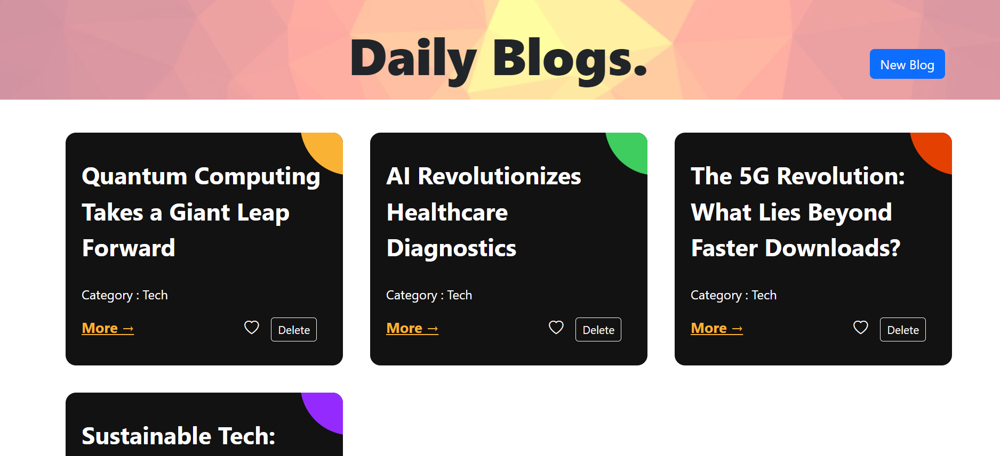

# React blogPost app

A “Blog post app” using React, Redux and Context API. Application contain list of blog post. Users can add new post, view the details of the blog post and also can delete and ❤️ like the post.


## Installation

Install project with npm

```bash
  npm install [ it will install required packges ]
  cd blogs
  npm start
```
    
## Deployment

To deploy this project run

```bash
  npm run build (it will create a build folder )
  npm install -g surge
  surge
```
deployed URL using Surge : [Manoj-Blogpost](http://manoj-blogpost.surge.sh/)

## Operations

- Show the list of blog post.
- View details of the blog post.
- Add a new blog post.
- Edit the blog post.
- Delete the blog post.
- Like the blog post.


## Screenshots



